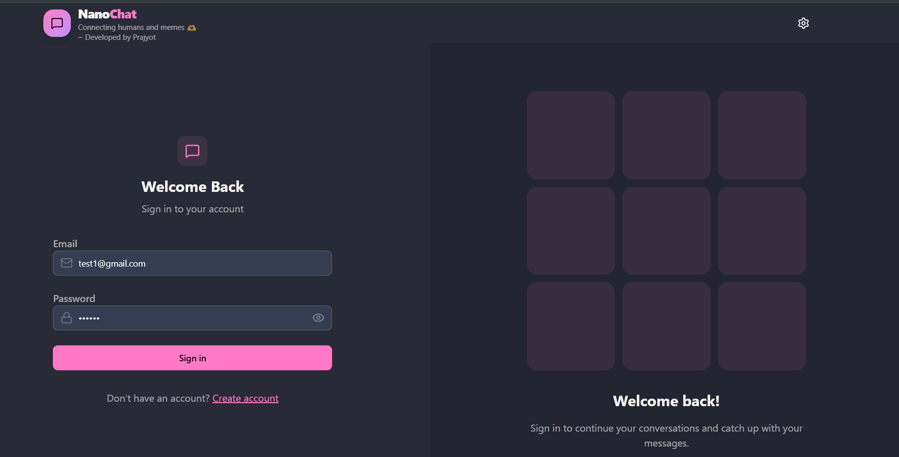
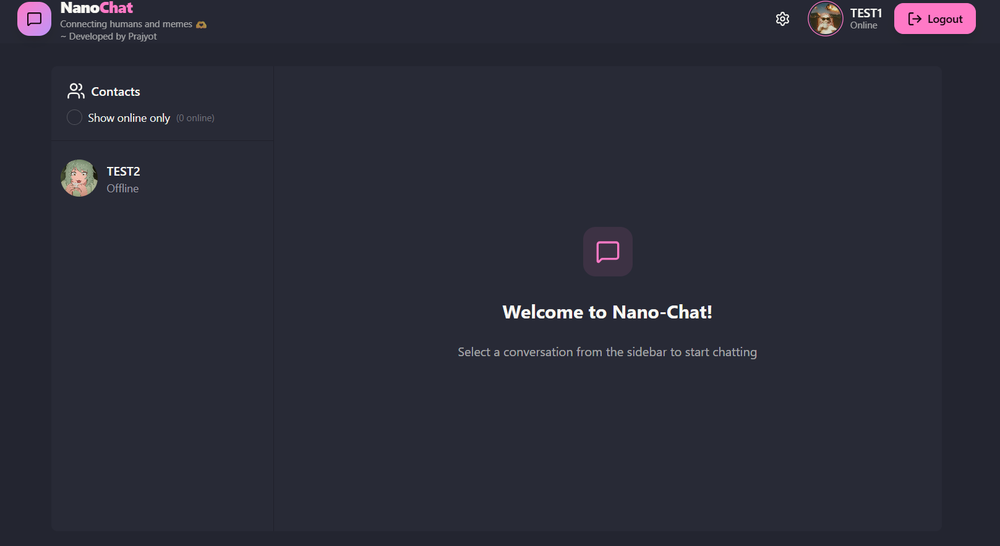
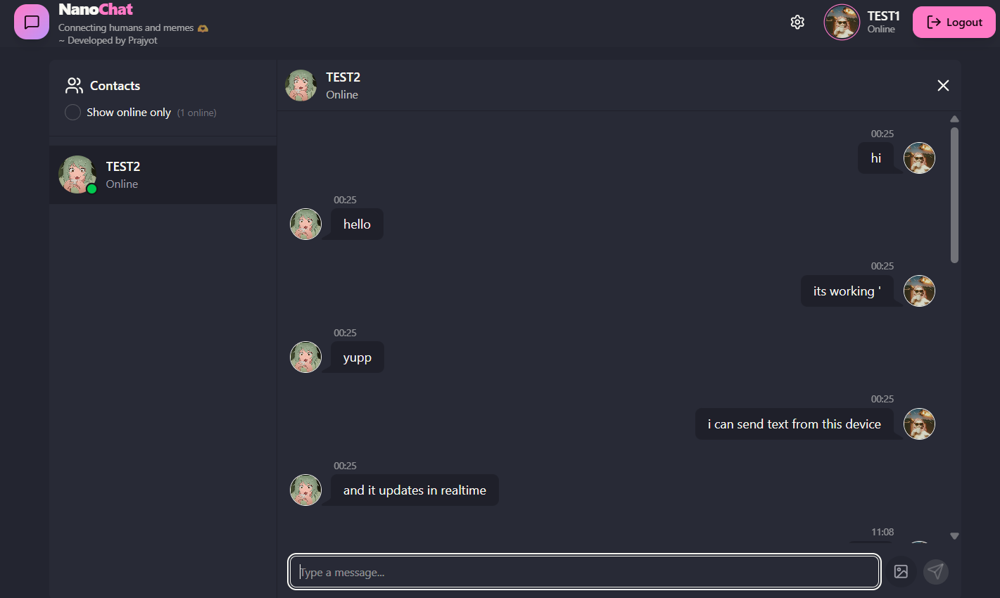
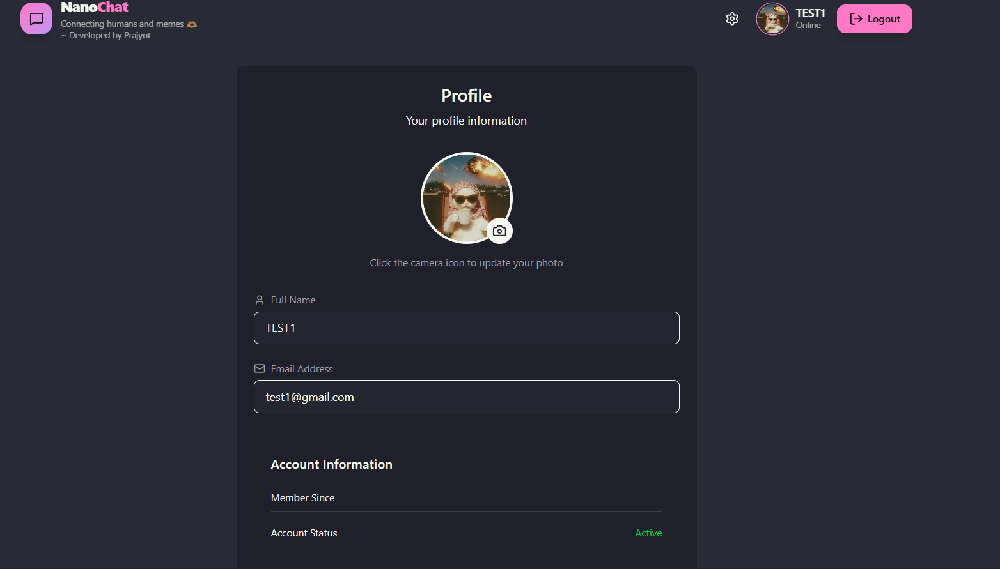

# 💬 Nano-Chat

A modern real-time chat application built using the **MERN Stack** and **Socket.IO**, designed for fast, secure, and seamless communication. Nano-Chat offers real-time messaging, secure authentication, profile customization, image sharing, and live online user status in a clean, responsive interface.

---

🚀 Live Website:( https://nano-chat-1.onrender.com )


---

## ✨ Features

- 🔐 Secure JWT Authentication
- 🍪 Cookie-Based Session Management
- 💬 Real-Time One-to-One Messaging
- ⚡ Socket.IO Powered Communication
- 🟢 Live Online User Status
- 📷 Image Sharing via Cloudinary
- 👤 User Profile Management
- 🖼️ Profile Picture Upload
- 🌙 32 DaisyUI Themes
- 📱 Fully Responsive Design
- ⚡ Fast React + Vite Frontend
- 🔒 Protected Routes
- 🗂️ Zustand State Management
- 🎨 Modern UI with Tailwind CSS & DaisyUI

---

# 🛠️ Tech Stack

## Frontend

- React.js
- Vite
- Tailwind CSS
- DaisyUI
- Zustand
- Axios
- React Router DOM
- React Hot Toast
- Socket.IO Client
- Lucide React

## Backend

- Node.js
- Express.js
- MongoDB
- Mongoose
- JWT Authentication
- Cookie Parser
- Cloudinary
- Socket.IO
- CORS

---

# 📂 Project Structure

```
Nano-Chat
│
├── backend
│   ├── src
│   │   ├── controllers
│   │   ├── middleware
│   │   ├── models
│   │   ├── routes
│   │   ├── lib
│   │   ├── socket.io.js
│   │   └── index.js
│
├── frontend
│   ├── src
│   │   ├── components
│   │   ├── pages
│   │   ├── store
│   │   ├── lib
│   │   ├── assets
│   │   └── App.jsx
│
└── README.md
```

---

# 🚀 Installation

## Clone Repository

```bash
git clone https://github.com/prajyot1093/Nano-Chat.git

cd Nano-Chat
```

---

## Install Backend

```bash
cd backend

npm install
```

---

## Install Frontend

```bash
cd ../frontend

npm install
```

---

# 🔑 Environment Variables

Create a **.env** file inside the **backend** folder.

```env
PORT=5001

MONGODB_URI=your_mongodb_connection_string

JWT_SECRET=your_jwt_secret

CLOUDINARY_CLOUD_NAME=your_cloud_name

CLOUDINARY_API_KEY=your_api_key

CLOUDINARY_API_SECRET=your_api_secret
```

---

# ▶️ Run the Project

## Backend

```bash
cd backend

npm run dev
```

---

## Frontend

```bash
cd frontend

npm run dev
```

---

# 📡 API Endpoints

## Authentication

| Method | Endpoint |
|----------|----------------------------|
| POST | `/api/auth/signup` |
| POST | `/api/auth/login` |
| POST | `/api/auth/logout` |
| GET | `/api/auth/check` |
| PUT | `/api/auth/update-profile` |

---

## Messages

| Method | Endpoint |
|----------|-----------------------------|
| GET | `/api/messages/users` |
| GET | `/api/messages/:id` |
| POST | `/api/messages/send/:id` |

---

# ⚙️ Application Workflow

### User Authentication

- User creates an account.
- JWT token is generated.
- Token is stored securely in cookies.
- Protected routes become accessible.

---

### Chat Flow

- Users appear in the sidebar.
- Selecting a user loads previous messages.
- Messages are stored in MongoDB.
- Socket.IO instantly delivers new messages.
- Online user list updates automatically.

---

# 📸 Screenshots

## 🔐 Login



---

## 🏠 Home



---

## 💬 Chat



---
## 👤 Profile



---

## ⚙️ Settings


---

# 🌟 Future Enhancements

- 👥 Group Chats
- 🎥 Video Calling
- 📞 Voice Calling
- 🎙️ Voice Messages
- 😀 Emoji Picker
- ❤️ Message Reactions
- ⌨️ Typing Indicators
- ✔️ Read Receipts
- 🔍 Chat Search
- 📌 Pinned Messages
- 🔔 Push Notifications
- 🔐 End-to-End Encryption

---

# 🤝 Contributing

Contributions are welcome.

1. Fork the repository.

2. Create a new branch.

```bash
git checkout -b feature-name
```

3. Commit your changes.

```bash
git commit -m "Added new feature"
```

4. Push to your branch.

```bash
git push origin feature-name
```

5. Open a Pull Request.

---

# 👨‍💻 Author

**Prajyot Punde**

### GitHub

https://github.com/prajyot1093


# 📄 License

This project is licensed under the **MIT License**.

---

# ⭐ Show Your Support

If you found this project helpful, consider giving it a ⭐ on GitHub.

